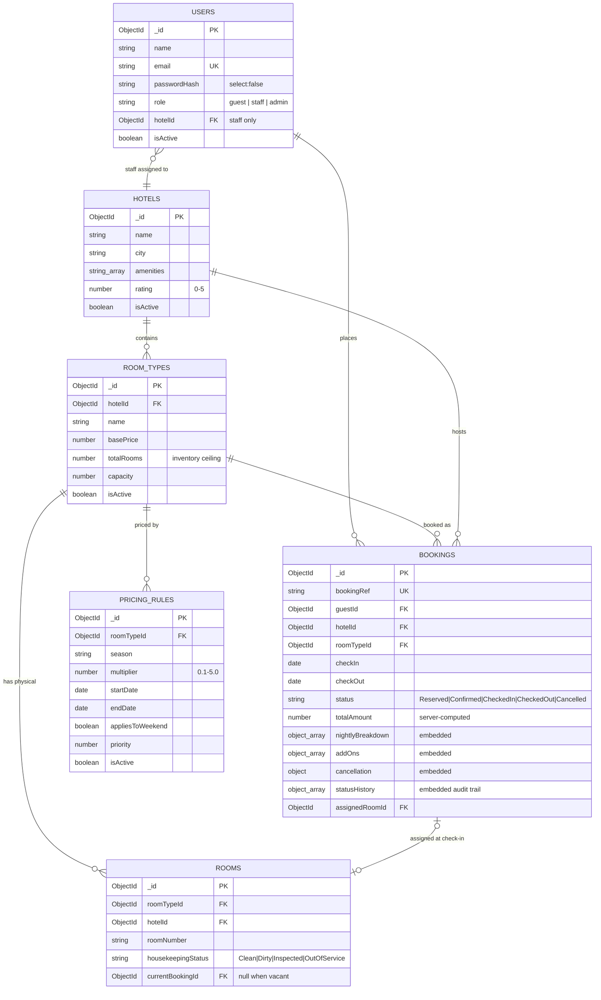

# P03 — Hotel Room Booking & Reservation Platform

A backend REST API for a multi-property hotel chain: availability search across
properties and date ranges, reservations with a real double-booking guard,
dynamic seasonal pricing, front-desk check-in/check-out, housekeeping tracking,
a tiered refund engine, invoicing, and aggregation-based occupancy reporting.

**Backend-focused.** The API is the deliverable and is demonstrated in full
through the committed Postman collection. A minimal static UI is also served
from `public/` so the same endpoints can be exercised in a browser; it holds no
business logic of its own and adds no functionality beyond the documented API.

---

## 1. Team Details

> **ACTION REQUIRED BEFORE SUBMISSION — replace every placeholder below.**
> This table must also be reproduced verbatim as page 1 of the submission PDF.
> A submission missing it is not evaluated.

**Project Code & Title:** P03 — Hotel Room Booking & Reservation Platform
**Course:** Advanced JavaScript Backend Frameworks (Node.js & Express JS)
**Section / Batch:** `<SECTION>`
**Semester:** 5th Semester
**Team Number:** `<NN>`

| S.No | Student Name | Roll No. | Department | Section |
|---|---|---|---|---|
| 1 | BLESSON BABY/2460346/COMPUTER SCIENCE AND ENGINEERING/5BTCSA
| 2 | ANURAG ETTA/2460336/ COMPUTER SCIENCE AND ENGINEERING/5BTCSA
| 3 | ASWIN PREM P P /2460477/COMPUTER SCIENCE AND ENGINEERING/5BTCSA
| 4 | Anishkaarthik 2460330 5BTCSACOMPUTER SCIENCE ENGINEERING

**GitHub Repository:** `<https://github.com/...>`

---

## 2. Project Code & Course

| | |
|---|---|
| Project Code | **P03** · Domain: Hospitality |
| Course | Advanced JavaScript Backend Frameworks (Node.js & Express JS) |
| Assessment | CIA-3 Team Project |
| Semester | 5th Semester |
| Institution | Christ University, in collaboration with L&T EduTech |

---

## 3. Problem Statement

A hotel chain operating several properties has three groups of users pulling in
different directions. Guests need to find a room that is genuinely free across a
date range, see what it will actually cost, book it, and manage that booking
afterwards. Front-desk staff need to run arrivals and departures, assign a
physical room that housekeeping has actually cleaned, and keep the floor status
current. Management needs to know how full the properties were and what they
earned.

The hard part is not the CRUD — it is the business rules underneath. Inventory
is held at the *room type* level, so availability is an overlap calculation
rather than a flag on a row, and two simultaneous requests for the last room
must not both succeed. Rates change per night depending on season and day of
week. A booking moves through a fixed lifecycle in which most transitions are
illegal. This project implements those rules as the substance of the system,
with the REST surface as the thin layer on top.

---

## 4. Tech Stack

| Concern | Choice | Version |
|---|---|---|
| Runtime | Node.js | v18+ (developed on v22) |
| Framework | Express.js | ^4.21.2 |
| Database | MongoDB via Mongoose ODM | ^8.9.5 |
| Authentication | `jsonwebtoken` | ^9.0.2 |
| Password hashing | `bcryptjs` | ^3.0.2 |
| Validation | `express-validator` | ^7.3.2 |
| Configuration | `dotenv` | ^16.4.7 |
| Security | `helmet`, `cors`, `express-rate-limit` | ^8.3.0 / ^2.8.5 / ^8.7.0 |
| Logging | `morgan` | ^1.10.0 |
| Dev reload | `nodemon` | ^3.1.9 |
| API demonstration | Postman collection v2.1 | committed in `docs/` |
| Demonstration UI | Static HTML/CSS/vanilla JS, served by `express.static` | no build step, no framework |

`bcryptjs` is the pure-JavaScript implementation of bcrypt. It is API-compatible
with `bcrypt` and needs no native build toolchain, which keeps `npm install`
working on every team member's machine.

---

## 5. Setup Instructions

**Prerequisites:** Node.js v18+, and either a local MongoDB Community Server on
port 27017 or a free MongoDB Atlas cluster.

```bash
# 1. Clone and enter the project
git clone <REPO_URL>
cd LNT_CIA3

# 2. Install dependencies
npm install

# 3. Create your environment file
cp .env.example .env          # Windows: copy .env.example .env
```

Open `.env` and set at minimum `MONGO_URI` and `JWT_SECRET`. The app **refuses
to start** without them — there is deliberately no hardcoded fallback for a
database URI or a signing secret.

```bash
# 4. Load the demo data (idempotent — safe to re-run)
npm run seed

# 5. Start the server
npm run dev                   # or: npm start
```

Confirm it is up:

```bash
curl http://localhost:5000/api/health
```

**Using MongoDB Atlas instead of a local server:** create a free M0 cluster, add
a database user, allow your IP under Network Access, then set
`MONGO_URI=mongodb+srv://<user>:<password>@<cluster>/hotel_booking_p03` in
`.env`. Nothing else changes. Atlas is a replica set, so the optional
transactional path in the booking guard is also available there.

### Environment variables

| Variable | Required | Purpose |
|---|---|---|
| `PORT` | no (default 5000) | HTTP port |
| `MONGO_URI` | **yes** | MongoDB connection string |
| `JWT_SECRET` | **yes** | Signing secret for access tokens |
| `JWT_EXPIRES_IN` | no (default `1d`) | Token lifetime |
| `BCRYPT_SALT_ROUNDS` | no (default 10) | Password hashing cost |
| `TAX_PERCENT` | no (default 12) | Hospitality tax applied to invoices |
| `NODE_ENV` | no | `development` exposes stack traces on 500s |

---

## 6. Implemented Modules

All thirteen required modules are implemented and demonstrable.

| # | Module | Status | Endpoints |
|---|---|---|---|
| M1 | Guest Registration & Authentication | Done | `POST /api/auth/register`, `POST /api/auth/login`, `GET /api/auth/me`, `POST /api/admin/users` |
| M2 | Hotel & Property Management | Done | `POST/GET /api/hotels`, `GET/PUT/DELETE /api/hotels/:id` |
| M3 | Room Type & Inventory Management | Done | `POST/GET /api/hotels/:hotelId/room-types`, `PUT/DELETE /api/room-types/:id`, `POST /api/room-types/:roomTypeId/rooms`, `GET /api/rooms` |
| M4 | Availability Search Engine | Done | `GET /api/hotels/search` |
| M5 | Reservation Booking Workflow | Done | `POST /api/bookings`, `GET /api/bookings`, `GET /api/bookings/:id` |
| M6 | Dynamic Pricing Rules | Done | `POST/GET /api/room-types/:roomTypeId/pricing-rules`, `PUT/DELETE /api/pricing-rules/:id`, `GET /api/room-types/:id/quote` |
| M7 | Booking Status Management | Done | `PUT /api/bookings/:id/confirm` (state machine governs every transition) |
| M8 | Check-in / Check-out | Done | `PUT /api/bookings/:id/checkin`, `PUT /api/bookings/:id/checkout` |
| M9 | Housekeeping Status Tracking | Done | `PATCH /api/rooms/:id/housekeeping`, `GET /api/hotels/:hotelId/housekeeping-board` |
| M10 | Cancellation & Refund Policy Engine | Done | `PUT /api/bookings/:id/cancel` |
| M11 | Guest Booking History | Done | `GET /api/guests/:id/bookings` |
| M12 | Invoice Generation Summary | Done | `GET /api/bookings/:id/invoice` |
| M13 | Admin Occupancy Reports | Done | `GET /api/admin/reports/occupancy`, `GET /api/admin/reports/revenue` |

---

## 7. API Endpoint Reference

| # | Method | Endpoint | Auth | Description |
|---|---|---|---|---|
| 1 | POST | `/api/auth/register` | public | Register a guest account and return a token |
| 2 | POST | `/api/auth/login` | public | Authenticate and return a token |
| 3 | GET | `/api/auth/me` | any | Current authenticated user |
| 4 | POST | `/api/admin/users` | admin | Create a staff or admin account |
| 5 | POST | `/api/hotels` | admin | Create a property |
| 6 | GET | `/api/hotels` | public | List properties (`city`, `minRating`, `page`, `limit`) |
| 7 | GET | `/api/hotels/:id` | public | One property with its room types |
| 8 | PUT | `/api/hotels/:id` | admin | Update a property |
| 9 | DELETE | `/api/hotels/:id` | admin | Soft-delete a property |
| 10 | POST | `/api/hotels/:hotelId/room-types` | admin | Create a room type |
| 11 | GET | `/api/hotels/:hotelId/room-types` | public | Room types for a property |
| 12 | PUT | `/api/room-types/:id` | admin | Update a room type |
| 13 | DELETE | `/api/room-types/:id` | admin | Soft-delete a room type |
| 14 | POST | `/api/room-types/:roomTypeId/rooms` | admin, staff | Add a physical room |
| 15 | GET | `/api/rooms` | staff, admin | List rooms (`hotelId`, `roomTypeId`, `housekeepingStatus`) |
| 16 | GET | `/api/hotels/search` | public | Availability search with live counts and quoted totals |
| 17 | POST | `/api/room-types/:roomTypeId/pricing-rules` | admin | Create a pricing rule |
| 18 | GET | `/api/room-types/:roomTypeId/pricing-rules` | staff, admin | List pricing rules |
| 19 | PUT | `/api/pricing-rules/:id` | admin | Update a pricing rule |
| 20 | DELETE | `/api/pricing-rules/:id` | admin | Delete a pricing rule |
| 21 | GET | `/api/room-types/:id/quote` | public | Price preview; creates nothing |
| 22 | POST | `/api/bookings` | guest | Create a reservation |
| 23 | GET | `/api/bookings` | staff, admin | List bookings (`status`, `hotelId`, `from`, `to`, paginated) |
| 24 | GET | `/api/bookings/:id` | owner, staff, admin | One booking |
| 25 | PUT | `/api/bookings/:id/confirm` | staff, admin | Reserved → Confirmed |
| 26 | PUT | `/api/bookings/:id/cancel` | owner, staff, admin | Cancel and compute the refund |
| 27 | PUT | `/api/bookings/:id/checkin` | staff, admin | Assign a room and check in |
| 28 | PUT | `/api/bookings/:id/checkout` | staff, admin | Check out, release the room, issue the invoice |
| 29 | PATCH | `/api/rooms/:id/housekeeping` | staff, admin | Update housekeeping status |
| 30 | GET | `/api/hotels/:hotelId/housekeeping-board` | staff, admin | Rooms grouped by status |
| 31 | GET | `/api/guests/:id/bookings` | owner, admin | Guest booking history |
| 32 | GET | `/api/bookings/:id/invoice` | owner, staff, admin | Invoice summary |
| 33 | GET | `/api/admin/reports/occupancy` | admin | Occupancy rate, revenue, ADR |
| 34 | GET | `/api/admin/reports/revenue` | admin | Revenue by hotel, room type or month |
| 35 | GET | `/api/health` | public | Liveness check |

### Response envelope

Every response uses the same shape.

```jsonc
// success
{ "success": true, "message": "Booking created successfully", "data": { } }

// paginated success
{ "success": true, "message": "...", "data": [ ],
  "meta": { "page": 1, "limit": 10, "total": 42, "totalPages": 5 } }

// error
{ "success": false, "message": "...", "errorCode": "VALIDATION_ERROR", "errors": [ ] }
```

### Error codes

| errorCode | HTTP | Raised when |
|---|---|---|
| `VALIDATION_ERROR` | 400 | express-validator failure; `errors[]` carries field detail |
| `INVALID_DATE_RANGE` | 400 | `checkOut <= checkIn` |
| `PAST_DATE` | 400 | `checkIn` before today |
| `CAPACITY_EXCEEDED` | 400 | `guests > roomType.capacity` |
| `INVALID_ID` | 400 | Malformed ObjectId |
| `INVALID_CREDENTIALS` | 401 | Login failure (identical for unknown email and wrong password) |
| `UNAUTHENTICATED` | 401 | Missing token |
| `INVALID_TOKEN` | 401 | Malformed or expired token |
| `FORBIDDEN` | 403 | Wrong role, or an ownership / hotel-scoping violation |
| `NOT_FOUND` | 404 | Resource does not exist |
| `DUPLICATE_EMAIL` | 409 | Email already registered |
| `DUPLICATE_RESOURCE` | 409 | Any other unique-index violation (E11000) |
| `NO_AVAILABILITY` | 409 | Double-booking prevented |
| `INVALID_STATUS_TRANSITION` | 409 | State-machine violation |
| `INVENTORY_CONFLICT` | 409 | `totalRooms` below the physical room count |
| `NO_CLEAN_ROOM_AVAILABLE` | 409 | No assignable room at check-in |
| `ROOM_OCCUPIED` | 409 | Housekeeping change blocked by an occupant |
| `TOO_EARLY_TO_CHECKIN` | 409 | Check-in attempted before the check-in date |
| `NOT_CANCELLABLE` | 409 | Booking already checked in, out, or cancelled |
| `IN_USE` | 409 | Delete blocked by dependent records |
| `INTERNAL_ERROR` | 500 | Anything unhandled |

---

## 8. Database Schema Summary

Six collections: `users`, `hotels`, `roomTypes`, `rooms`, `bookings`,
`pricingRules`.

```
users (1) ──< (N) bookings >── (1) hotels
                   │
                   └──> (1) roomTypes ──< (N) rooms
                                   │
                                   └──< (N) pricingRules

users(role=staff) (N) ──> (1) hotels        [staff assignment]
bookings (1) ──> (0..1) rooms               [assignedRoomId, set at check-in]
```



### Extension fields

Fields beyond the base brief, each with its reason:

| Collection | Field | Why |
|---|---|---|
| `users` | `phone` | Front-desk contact for the reservation |
| `users` | `hotelId` | Required for staff hotel-scoping; without it a staff member could act on any property |
| `users` | `isActive` | Disable an account without destroying its booking history |
| `hotels` | `address` | Needed on the invoice header |
| `hotels` | `isActive` | Soft delete; inactive properties drop out of search |
| `roomTypes` | `description`, `isActive` | Search result copy; soft delete |
| `rooms` | `hotelId` | Denormalized so staff scoping and the housekeeping board filter without a join |
| `rooms` | `currentBookingId` | The single source of truth for occupancy |
| `pricingRules` | `startDate`, `endDate` | Without a window, `season` is only a label with nothing to evaluate |
| `pricingRules` | `appliesToWeekend` | Expresses a Fri/Sat rule directly |
| `pricingRules` | `priority` | Decides which rule wins when several match one night |
| `pricingRules` | `isActive` | Retire a rule without losing the historical record |
| `bookings` | `bookingRef` | Human-readable reference quoted to the guest |
| `bookings` | `guests` | Occupancy, validated against capacity |
| `bookings` | `nightlyBreakdown` | Immutable price snapshot taken at booking time |
| `bookings` | `addOns`, `taxAmount` | Invoice line items and tax |
| `bookings` | `assignedRoomId`, `actualCheckInAt`, `actualCheckOutAt` | Front-desk record of the actual stay |
| `bookings` | `cancellation` | Refund audit, present only once cancelled |
| `bookings` | `statusHistory` | Append-only audit of every lifecycle transition |

---

## 9. Design Decisions

### 9.1 Reference vs embed

**Embedded** in `bookings`: `nightlyBreakdown`, `addOns`, `cancellation`,
`statusHistory`. All four are small, bounded, always read together with their
booking, and never queried on their own. `nightlyBreakdown` in particular *must*
be embedded: it is a price snapshot taken at booking time, and re-deriving it
later from the live `basePrice` would silently rewrite an old invoice whenever a
rate changed.

**Referenced** from `bookings`: `guestId`, `hotelId`, `roomTypeId`. Those
documents are larger, shared across many bookings, and updated on their own
schedule. Embedding a guest into every booking would duplicate their details and
require a fan-out write whenever they changed a phone number.

**Referenced, not embedded**, for `rooms` under `roomTypes`: a property may have
hundreds of physical rooms whose housekeeping status changes several times a
day. Embedding them would force a rewrite of the entire parent room-type
document on every single housekeeping update.

### 9.2 Indexes

| Collection | Index | Reason |
|---|---|---|
| `users` | `{ email: 1 }` unique | Enforces uniqueness and covers the login lookup |
| `hotels` | `{ name: 1 }` | Name lookup and the admin listing |
| `hotels` | `{ city: 1, isActive: 1 }` | Search filters on city first, then active |
| `hotels` | `{ name: 1, city: 1 }` unique | One brand may exist in two cities, not twice in one |
| `roomTypes` | `{ hotelId: 1 }` | Fetch-by-relation, used on every property page |
| `roomTypes` | `{ hotelId: 1, name: 1 }` unique | No duplicate type names within a property |
| `rooms` | `{ roomTypeId: 1 }` | Fetch-by-relation, used by the check-in room picker |
| `rooms` | `{ hotelId: 1, roomNumber: 1 }` unique | No duplicate room numbers within a property |
| `rooms` | `{ hotelId: 1, housekeepingStatus: 1 }` | Backs the housekeeping board |
| `bookings` | `{ guestId: 1 }` | Booking-history lookup |
| `bookings` | `{ bookingRef: 1 }` unique | Guests quote the reference, not the ObjectId |
| `bookings` | `{ roomTypeId: 1, checkIn: 1, checkOut: 1, status: 1 }` | **The hot path.** Covers the overlap query end to end |
| `bookings` | `{ hotelId: 1, status: 1 }` | Front-desk arrivals and departures list |
| `pricingRules` | `{ roomTypeId: 1, isActive: 1 }` | Rate resolution loads exactly this set per quote |

The compound index on `bookings` deserves the emphasis. The availability engine
runs one overlap count per room type on every search result *and* on every
booking attempt. Its predicate is `roomTypeId` + two date bounds + `status`, and
the index field order mirrors that exactly, so the query is served from the
index without touching documents.

### 9.3 How double-booking is prevented

Inventory is held at the room-type level, so "is a room free" is an overlap
count, not a flag:

```
bookedUnits = count of bookings where
    roomTypeId = X
    AND status IN ['Reserved', 'Confirmed', 'CheckedIn']
    AND existing.checkIn  <  requested.checkOut
    AND existing.checkOut >  requested.checkIn

availableRooms = roomType.totalRooms - bookedUnits
```

The inequalities are **strict**. A booking ending on the 10th and one starting
on the 10th do not overlap: the departing guest leaves in the morning and the
arriving guest checks in that afternoon. Same-day turnover is legal and the room
is legitimately sold on both bookings. Using `<=` / `>=` would refuse a night of
revenue on every changeover.

Checking before inserting is not enough on its own. Two concurrent requests can
both read "1 room left" before either has written, and both then insert. So
`POST /api/bookings` runs **check → insert → verify → roll back**:

1. Compute availability. If zero, reject with `409 NO_AVAILABILITY`.
2. Insert the booking.
3. **Re-run the overlap count immediately after the insert.**
4. If the count now exceeds `totalRooms`, this request lost the race: delete the
   booking it just created and return `409 NO_AVAILABILITY`.

The verification step is what makes the guard real on a standalone MongoDB. On a
replica set (including any Atlas cluster) steps 1–3 can additionally be wrapped
in `session.withTransaction()`; the verify step stays regardless, because it is
what closes the window rather than the transaction.

`Cancelled` and `CheckedOut` are deliberately absent from the blocking status
list. That is why cancelled inventory reappears in search results immediately,
with no compensating write anywhere.

Implementation: [`services/availability.service.js`](services/availability.service.js)
and `createBooking` in [`controllers/booking.controller.js`](controllers/booking.controller.js).

### 9.4 Why pricing multipliers are not stacked

Per night, the engine collects every active rule that applies — the night falls
inside the rule's date window (a rule with no window always qualifies on date),
and either the rule is not weekend-only or the night is a Friday or Saturday. If
none apply the multiplier is exactly `1.0`; there is no implicit surcharge
anywhere. If several apply, the **highest `priority` wins**, ties broken by the
**highest `multiplier`**, and `nightRate = round(basePrice × multiplier, 2)`.

**Exactly one rule wins each night. Multipliers are never multiplied together.**
This is a deliberate decision, not an oversight. Stacking would make the final
rate depend on how many overlapping marketing campaigns happen to exist at once,
which is neither predictable for the guest nor explainable at the front desk —
three modest 1.2× rules would silently become 1.73×. Taking the single
highest-priority rule keeps the rate explainable: one rule, one reason.

Implementation: [`services/pricing.service.js`](services/pricing.service.js).

### 9.5 Where validation lives, and why not in the controller

Every write endpoint carries an `express-validator` chain from `validators/`,
terminated by `middleware/validate.js`, which turns accumulated failures into a
single `400 VALIDATION_ERROR` with field-level detail. Controllers therefore
never do primitive field checking and can assume well-formed input, dealing only
with business rules. Dates are validated as ISO-8601 and normalized to date-only
UTC *in the validator*, so everything downstream compares like with like.

The booking validator also explicitly **rejects** `totalAmount`, `taxAmount`,
`status`, `bookingRef` and `nightlyBreakdown`. Those are the server's to decide;
a client sending them is trying to set its own bill.

### 9.6 Error handling

`middleware/errorHandler.js` is mounted last, after all routes and after
`notFound`. It is the only place in the application that formats an error
response. Every async controller is wrapped in `asyncHandler`, so a rejected
promise reaches `next(err)` instead of becoming an unhandled rejection. The
handler translates Mongoose `ValidationError` → 400, `CastError` → 400
`INVALID_ID`, driver code `11000` → 409 `DUPLICATE_RESOURCE`, and the two JWT
error types → 401. Stack traces appear only when `NODE_ENV !== 'production'`.
`process.on('unhandledRejection')` and `process.on('uncaughtException')` log and
exit cleanly rather than leaving the process in an undefined state.

### 9.7 Time zones

Every date is normalized to 00:00 UTC. Hotel nights are calendar days, not
instants; doing the arithmetic in the server's local zone would shift which
night a stay falls on for anyone east or west of UTC — and IST is +05:30, so a
booking made after 18:30 local would land on the wrong day. All of it goes
through [`utils/dates.js`](utils/dates.js).

---

## 10. Seed Credentials

`npm run seed` is idempotent: it clears the collections it owns and rebuilds
them, so repeated runs leave the database in the same state. All dates are
relative to the run date, so the "upcoming stay", "arriving today" and
"completed last week" demos keep working indefinitely.

**These are demo passwords for a local database only.**

| Role | Email | Password |
|---|---|---|
| Admin | `admin@hotel.test` | `Admin@123` |
| Staff (Bengaluru) | `staff.blr@hotel.test` | `Staff@123` |
| Staff (Kochi) | `staff.kochi@hotel.test` | `Staff@123` |
| Guest 1 | `guest1@hotel.test` | `Guest@123` |
| Guest 2 | `guest2@hotel.test` | `Guest@123` |
| Guest 3 | `guest3@hotel.test` | `Guest@123` |

Seeded data: 3 hotels across 3 cities, 7 room types (one deliberately at
`totalRooms: 1` so the double-booking demo needs only a single existing
booking), 23 physical rooms with mixed housekeeping states, 14 pricing rules
(a weekend rule and a seasonal rule per room type), and 8 bookings spanning
every status — including a completed past stay so the occupancy report returns
non-zero figures on a first run.

---

## 11. Postman

Two files in `docs/`:

- `P03_Hotel_Booking.postman_collection.json`
- `P03_Hotel_Booking.postman_environment.json`

A published run of the full suite (181 assertions, 0 failures) is also viewable
here: <https://helen-biju-7311715.postman.co/workspace/HELEN-BIJU-2460371's-Workspace~fe3e72a3-95ee-421d-8a83-fce9fbbacca8/run/58089418-d7707bfd-4d85-4497-b2be-dc2de6b8457c?action=share&creator=58089418&active-environment=58089418-97e7a178-494e-4c12-b706-6ff47fa85d6a>
The committed files above remain the source of truth; the link requires access
to the Postman workspace.

**To run:**

1. Postman → **Import** → select both files.
2. Choose the **P03 — Local** environment from the top-right selector.
3. Make sure the API is running (`npm run dev`) and the database is seeded
   (`npm run seed`).
4. Open **Collection Runner**, select the whole collection, and Run.

The collection contains **15 folders, 89 requests and 181 assertions**:

| Folder | Contents |
|---|---|
| `00 — Demo Flow` | The full end-to-end journey: register → search → book → confirm → check in → check out → occupancy report |
| `M1`–`M13` | One folder per module, in order, covering all 35 endpoints |
| `99 — Negative Paths` | The required negative-test matrix |

Tokens and resource ids are captured automatically by test scripts, and all
dates are computed from the run date by a collection-level pre-request script,
so the collection runs top to bottom on freshly seeded data with **no manual
copy-paste and no date editing**.

### Required negative-path matrix

| # | Case | Expected | Where |
|---|---|---|---|
| 1 | Happy path: register → login → create booking | 201 | `00 — Demo Flow` |
| 2 | `POST /api/bookings` missing `checkOut` | 400 `VALIDATION_ERROR` | `99 / N2` |
| 3 | `GET /api/auth/me` with no token | 401 `UNAUTHENTICATED` | `99 / N3` |
| 4 | Guest token on `POST /api/hotels` | 403 `FORBIDDEN` | `99 / N4` |
| 5 | Book the `totalRooms: 1` type twice, overlapping | 409 `NO_AVAILABILITY` | `99 / N5a`, `N5b` |
| 6 | `GET /api/bookings/64f1a2b3c4d5e6f7a8b9c0d1` | 404 `NOT_FOUND`, no crash | `99 / N6` |
| 7 | Check out a `Reserved` booking | 409 `INVALID_STATUS_TRANSITION` | `99 / N7` |

Also included, because they are the interesting ones to defend in a viva:

| Case | Expected |
|---|---|
| Same-day turnover (previous stay ends the day this one starts) | **201** — legal, and the reason the inequalities are strict |
| Guest A reading Guest B's booking history | 403 — ownership, not role |
| Kochi staff modifying a Bengaluru room | 403 — hotel scoping |
| Client-supplied `totalAmount` in the booking body | 400 — the price is never the client's to set |
| Unknown email vs wrong password on login | Byte-identical 401s — no user enumeration |
| Occupancy report over a period with no bookings | `occupancyRate: 0`, not `NaN` |

---

## 12. Known Limitations

- **The UI is a thin demonstration layer, not a product.** Static HTML, CSS and
  vanilla JavaScript served from `public/`, with no build step, no framework and
  no client-side state beyond the JWT in `localStorage`. It calls only the
  documented endpoints and recomputes no prices; ObjectIds are entered directly
  in some admin forms rather than being resolved through pickers. The Postman
  collection remains the authoritative demonstration of the API.
- **No payment, SMS or email integration.** Refunds are computed and recorded
  against the booking, not actually disbursed.
- **Self-built JWT auth only.** No social login and no refresh-token rotation;
  a token is valid until it expires.
- **Single currency (INR) and a single tax rate**, taken from `TAX_PERCENT`.
- **Room-type-level inventory.** Guests book a room *type*; a specific physical
  room is assigned at check-in. A guest cannot reserve a named room number.
- **No overbooking policy, waitlist, or group/corporate rate contracts.**
- **Concurrency is guarded, not serialized.** The check-insert-verify-rollback
  pattern closes the double-booking window correctly, but under sustained
  contention a losing request pays for an insert and a delete before it is told
  no. At this scale that is the right trade; a high-volume system would move the
  ceiling into an atomic counter document.
- **Soft deletes are not cascading.** Deactivating a hotel leaves its room types
  active; they simply become unreachable through search.

---

## 13. Credits

All application code in this repository was written by the team for this
assessment. No third-party code snippets were copied.

Open-source dependencies used under their respective licences, as declared in
`package.json`: Express, Mongoose, jsonwebtoken, bcryptjs, express-validator,
helmet, cors, express-rate-limit, morgan, dotenv, nodemon.

---

## Project Structure

```
.
├── config/
│   ├── db.js                      # Mongoose connection and error handling
│   └── env.js                     # Loads dotenv, validates required vars, exports config
├── models/
│   ├── User.js  Hotel.js  RoomType.js  Room.js  Booking.js  PricingRule.js
├── routes/
│   ├── auth.routes.js  admin.routes.js  hotel.routes.js  roomType.routes.js
│   ├── room.routes.js  pricingRule.routes.js  booking.routes.js
│   ├── guest.routes.js  report.routes.js
├── controllers/
│   ├── auth.controller.js  admin.controller.js  hotel.controller.js
│   ├── roomType.controller.js  room.controller.js  pricingRule.controller.js
│   ├── booking.controller.js  report.controller.js
├── services/
│   ├── availability.service.js    # Overlap counting and the double-booking guard
│   ├── pricing.service.js         # Per-night rate resolution
│   ├── refund.service.js          # Cancellation tiers
│   ├── invoice.service.js         # Invoice totals
│   └── bookingStatus.service.js   # The status state machine
├── middleware/
│   ├── auth.js                    # verifyToken
│   ├── roles.js                   # requireRole, requireSameHotel
│   ├── validate.js                # express-validator result handler
│   ├── notFound.js                # 404 catch-all
│   └── errorHandler.js            # Centralized error handler, mounted last
├── validators/
│   ├── common.js  auth.validator.js  booking.validator.js  hotel.validator.js
│   ├── roomType.validator.js  room.validator.js  pricingRule.validator.js
├── utils/
│   ├── ApiError.js                # Error class carrying statusCode + errorCode
│   ├── asyncHandler.js            # Forwards async rejections to next()
│   ├── response.js                # Envelope helpers
│   ├── dates.js                   # UTC date-only arithmetic
│   └── bookingRef.js              # Atomic human-readable reference generator
├── seed/
│   └── seed.js                    # Idempotent demo data loader
├── public/                         # Demonstration UI (static, no build step)
│   ├── index.html                  # Markup and one template per module
│   ├── styles.css
│   └── app.js                      # fetch() wrapper + a view per module
├── docs/
│   ├── P03_Hotel_Booking.postman_collection.json
│   ├── P03_Hotel_Booking.postman_environment.json
│   └── screenshots/
├── .env.example
├── .gitignore
├── package.json
├── README.md
└── server.js                      # Entry point: config, DB, middleware, routes, listen
```
